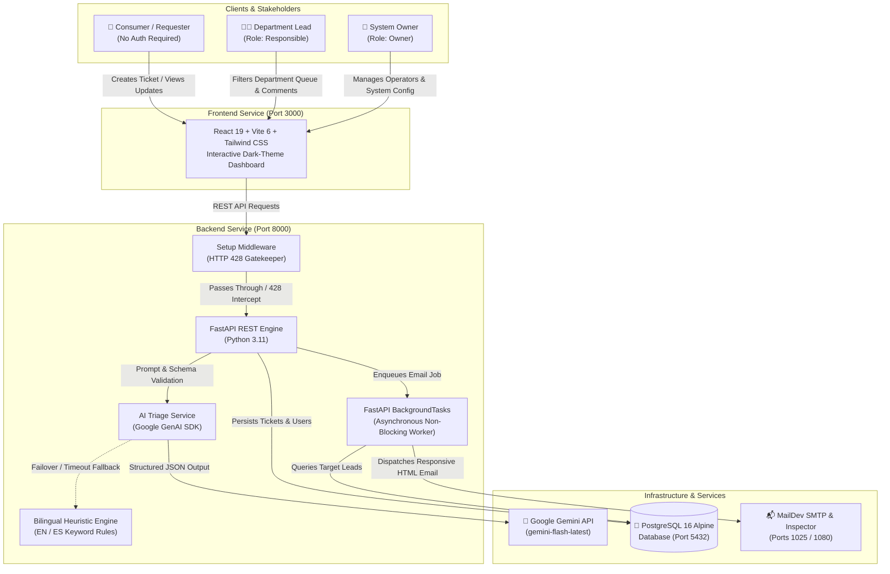
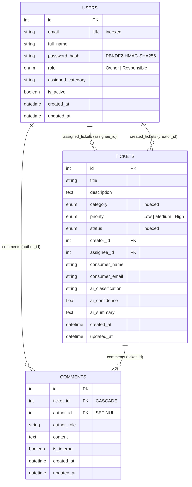

# 🎫 AI-Supported Ticket System

[](https://fastapi.tiangolo.com)
[](https://react.dev)
[](https://vitejs.dev)
[](https://www.postgresql.org)
[](https://ai.google.dev)
[](https://www.docker.com)
[](backend/tests)
[](LICENSE)

An enterprise-grade, dockerized support ticket workspace powered by **Google Gemini AI**, **FastAPI**, **React 19**, **PostgreSQL 16**, and an **Asynchronous Email Notification Service** inspected via **MailDev**.

---

## 📖 Table of Contents

- [Overview & Architecture](#-overview--architecture)
- [Architecture & Services Table](#-architecture--services)
- [Key Features](#-key-features)
- [Quick Start](#-quick-start)
  - [Prerequisites](#1-prerequisites)
  - [Docker Compose Deployment](#2-docker-compose-deployment-recommended)
  - [One-Click Windows Scripts](#3-one-click-windows-scripts)
  - [Local Native Development (Without Docker)](#4-local-native-development-without-docker)
- [Access Points & URLs](#-access-points--urls)
- [First-Time Setup Wizard (HTTP 428)](#-first-time-setup-wizard-http-428)
- [User Roles & Portals](#-user-roles--portals)
- [AI Triage & Resilient Fallback Engine](#-ai-triage--resilient-fallback-engine)
- [Asynchronous Notification Workflow](#-asynchronous-notification-workflow)
- [REST API Reference](#-rest-api-reference)
- [Database Schema & Performance](#-database-schema--performance)
- [Testing & Quality Assurance](#-testing--quality-assurance)
- [Environment Variables](#-environment-variables)
- [Project Directory Layout](#-project-directory-layout)
- [GitHub Wiki Documentation](#-github-wiki-documentation)
- [Troubleshooting & FAQs](#-troubleshooting--faqs)

---

## 🌟 Overview & Architecture

The **AI-Supported Ticket System** streamlines issue reporting, department triaging, and team communication through an automated, resilient pipeline:



---

## 🏛️ Architecture & Services

The complete platform runs in four containerized services orchestrated by Docker Compose:

| Service | Technology | Internal Port | Host Port | Description |
| :--- | :--- | :---: | :---: | :--- |
| **Frontend** | React 19 + Vite 6 + Tailwind CSS | `3000` | `3000` | Interactive user interface with hot-reloading, dark mode, and role-based portals |
| **Backend** | Python 3.11 + FastAPI + SQLAlchemy 2.0 | `8000` | `8000` | Asynchronous REST API with auto-generated Swagger docs and setup gatekeeper |
| **Database** | PostgreSQL 16 Alpine | `5432` | `5432` | ACID-compliant relational storage with persistent Docker volume |
| **MailDev** | MailDev SMTP & Web Inspector | `1025` / `1080` | `1025` / `1080` | Test SMTP server & web inspector for validating outgoing notification emails |

---

## ✨ Key Features

- 🤖 **Automated AI Triage**: Analyzes freeform text and attachments via Google Gemini, categorizing tickets into 6 departments (`Finance`, `Legal`, `Operations`, `IT Support`, `Human Resources`, `Customer Success`), assigning priority (`High`, `Medium`, `Low`), and generating a concise executive summary.
- 🛡️ **Zero-Downtime Heuristic Fallback**: Intelligent bilingual (English/Spanish) rule-based fallback guarantees continuous classification even if Gemini API keys are missing or during network timeouts.
- ⚡ **Asynchronous Automailing**: Non-blocking email dispatch powered by FastAPI `BackgroundTasks`. The client receives an instantaneous `HTTP 201 Created` response while emails are transmitted in the background.
- 👥 **Role-Based Dynamic Portals**:
  - **Public Consumer Portal**: Anyone can report problems without mandatory account creation.
  - **Responsible Lead Portal**: Department leads log in to access queues automatically filtered to their department (`?view=responsible`).
  - **System Owner Panel**: Central administrator dashboard for team management, system health, and master password protected factory reset (`?view=owner`).
- 🔐 **OWASP-Grade Security Baseline**: System master passwords and operator credentials are encrypted using `PBKDF2-HMAC-SHA256` with 600,000 rounds and random salts.
- 🚀 **Zero-Friction First-Time Setup**: If uninitialized, API requests are intercepted with `HTTP 428 Precondition Required`, directing the administrator to an interactive setup wizard.

---

## 🚀 Quick Start

### 1. Prerequisites
- [Docker](https://docs.docker.com/get-docker/) & Docker Compose installed.
- *(Optional for standalone local development)*: Python 3.11+ and Node.js 18+.

### 2. Docker Compose Deployment (Recommended)

1. **Clone the repository:**
   ```bash
   git clone https://github.com/fedecard38/AI-Supported-Ticket-System.git
   cd AI-Supported-Ticket-System
   ```

2. **Configure Environment Variables:**
   ```bash
   cp .env.example .env
   ```
   *(Optional: Add your `GEMINI_API_KEY` to `.env` or supply it directly in the web setup wizard on first launch).*

3. **Launch the Stack:**
   ```bash
   docker compose up --build -d
   ```

4. **Verify Container Status:**
   ```bash
   docker compose ps
   ```

5. **Tear Down Services:**
   ```bash
   # Stop containers
   docker compose down

   # Stop and wipe persistent database volume
   docker compose down -v
   ```

### 3. One-Click Windows Scripts

For Windows developers, automated startup scripts are provided in the repository root:
- **Batch Script**: Double-click `start.bat` or run:
  ```cmd
  start.bat
  ```
- **PowerShell Script**:
  ```powershell
  .\start.ps1
  ```
*These scripts build and launch all containers, wait for initialization, and automatically open your default browser to `http://localhost:3000`.*

### 4. Local Native Development (Without Docker)

If you prefer running services directly on your host machine:

#### Step A: Run PostgreSQL & MailDev
Ensure a PostgreSQL database named `ticket_system` is running locally on port `5432`, and MailDev on port `1025`/`1080` (or use Docker for just those two):
```bash
docker run -d --name local-postgres -p 5432:5432 -e POSTGRES_PASSWORD=postgres postgres:16-alpine
docker run -d --name local-maildev -p 1025:1025 -p 1080:1080 maildev/maildev:latest
```

#### Step B: Run FastAPI Backend
```bash
cd backend
python -m venv .venv

# On Windows:
.\.venv\Scripts\activate
# On Linux/macOS:
source .venv/bin/activate

pip install -r requirements.txt
uvicorn app.main:app --reload --host 127.0.0.1 --port 8000
```

#### Step C: Run React Frontend
```bash
cd frontend
npm install
npm run dev
```

---

## 🌐 Access Points & URLs

| Component | URL | Credentials / Notes |
| :--- | :--- | :--- |
| **Frontend Application** | [http://localhost:3000](http://localhost:3000) | Public ticket submission & portal navigation |
| **Responsible Lead Portal** | [http://localhost:3000/?view=responsible](http://localhost:3000/?view=responsible) | Operator login & category-scoped queues |
| **System Owner Administration** | [http://localhost:3000/?view=owner](http://localhost:3000/?view=owner) | Master owner login & system controls |
| **FastAPI Swagger Docs (OpenAPI)** | [http://localhost:8000/docs](http://localhost:8000/docs) | Interactive API exploration & testing |
| **ReDoc API Documentation** | [http://localhost:8000/redoc](http://localhost:8000/redoc) | Alternative formatted API specifications |
| **Backend Health Check** | [http://localhost:8000/health](http://localhost:8000/health) | Real-time JSON health report |
| **MailDev Web Inspector** | [http://localhost:1080](http://localhost:1080) | View, read, and inspect outgoing HTML emails |
| **MailDev SMTP Server** | `localhost:1025` | Standard SMTP transport target |
| **PostgreSQL Database** | `localhost:5432` | User: `postgres`, Pass: `postgres`, DB: `ticket_system` |

---

## 🔒 First-Time Setup Wizard (HTTP 428)

To ensure secure enterprise initialization, unconfigured instances prevent normal operations until configured by an authorized owner:

1. **State Detection**: On startup, the backend verifies whether `/app/config/setup_state.json` exists with status `ACTIVE`.
2. **Precondition Interception**: If absent, `SetupMiddleware` intercepts protected requests with:
   ```json
   {
     "detail": "System requires first-time setup before processing requests."
   }
   ```
3. **Interactive Setup Wizard**: The React frontend displays the `SetupModal` wizard, allowing the administrator to configure:
   - **System Owner Email** (e.g., `admin@ticketworkspace.com`)
   - **Owner Master Password** (hashed with PBKDF2 600,000 rounds)
   - **Google Gemini API Key** (validated live against Google's API)
   - **PostgreSQL Connection Details** (validated live via socket reachability)
4. **Transition to ACTIVE**: The configuration is persisted atomically to `setup_state.json`, database tables are initialized, and the application immediately unlocks.

---

## 👥 User Roles & Portals

The application implements three primary personas:

### 1. Consumer (Public Requester)
- **Authentication**: None required.
- **Actions**:
  - Browse public ticket status board.
  - Submit tickets with Title, Description, Requester Name, Email, and Attachment URL.
  - Preview AI triage classification in real time.
  - Automatically receive formatted HTML email updates when operators comment on their ticket.

### 2. Responsible Lead (Department Operator)
- **Authentication**: Email and password via `/?view=responsible`.
- **Actions**:
  - Automatically filtered queue showing only tickets in the lead's `assigned_category`.
  - Self-assign tickets or reassign to colleagues.
  - Advance ticket workflows: `Open` ➔ `In Progress` ➔ `Resolved` ➔ `Closed`.
  - Post public customer updates or internal staff notes.

### 3. System Owner (Master Administrator)
- **Authentication**: Master password configured during setup via `/?view=owner`.
- **Actions**:
  - View full system health (DB connection, MailDev, Gemini status).
  - Register new Responsible leads with specific department categories.
  - Edit user roles, update category routing, or deactivate operators.
  - Perform Master Password-protected **Factory Reset** (with optional DB wipe).

---

## 🤖 AI Triage & Resilient Fallback Engine

The triage pipeline (`backend/app/services/triage.py`) guarantees 100% classification availability:

1. **Google GenAI SDK**: Evaluates ticket requests using official `google-genai` SDK and structured JSON response schemas (`TicketClassification`).
2. **Model Cascade**: If the primary model experiences rate limits or deprecation, it automatically fails over across:
   `gemini-flash-latest` ➔ `gemini-3.5-flash` ➔ `gemini-3.8-flash`.
3. **Bilingual Heuristic Fallback**: If network timeouts (>30s) or missing API keys occur, an intelligent multilingual lexical parser takes over:
   - Evaluates keyword frequencies in English and Spanish across domain categories: `Finance`, `Legal`, `Operations`, `IT Support`, `Human Resources`, and `Customer Success`.
   - Analyzes severity keywords (`emergency`, `outage`, `bloqueado`, `cobro duplicado`) to determine priority (`High`, `Medium`, `Low`).
   - Synthesizes an executive summary from the core problem statement.

---

## ✉️ Asynchronous Notification Workflow

Notifications are executed via FastAPI's `BackgroundTasks` to preserve low API latency:

```
[Ticket Created]
       │
       ▼
[FastAPI Background Worker]
       │
       ├──► Query active Users WHERE role='Responsible' AND assigned_category=Ticket.Category
       │
       ├──► Generate Responsive Dark-Theme HTML Email
       │      • Ticket ID & Title
       │      • Priority Badge (Color-coded)
       │      • AI Executive Summary
       │      • Direct CTA Button to Responsible Portal
       │
       └──► Dispatch via SMTP to MailDev (localhost:1025)
              • Inspect instantly at http://localhost:1080
```

Similarly, when an operator comments on a ticket, a background notification is dispatched directly to the consumer's registered email address with real-time status updates and deep links.

---

## 📡 REST API Reference

All endpoints are fully documented interactively in Swagger UI at [http://localhost:8000/docs](http://localhost:8000/docs).

### System & Setup
| Method | Endpoint | Description | Auth Required |
| :--- | :--- | :--- | :---: |
| `GET` | `/health` | System health check (DB, MailDev, AI) | No |
| `GET` | `/api/setup/status` | Current setup state & owner configuration | No |
| `POST` | `/api/setup/initialize` | Initialize system with Owner credentials & DB config | No |
| `POST` | `/api/setup/factory-reset` | Reset system state (protected by Master Password) | Master Pass |

### User Management & Authentication
| Method | Endpoint | Description | Auth Required |
| :--- | :--- | :--- | :---: |
| `POST` | `/api/users/login` | Authenticate Owner or Responsible Lead | No |
| `GET` | `/api/users` | List all registered system operators | No (Dev) |
| `POST` | `/api/users` | Create new Responsible Lead with assigned category | Owner |
| `GET` | `/api/users/{id}` | Retrieve operator details by ID | Yes |
| `PATCH` | `/api/users/{id}` | Update operator role, category, or password | Yes |
| `DELETE` | `/api/users/{id}` | Delete operator account | Owner |

### Ticket Management & Comments
| Method | Endpoint | Description | Auth Required |
| :--- | :--- | :--- | :---: |
| `POST` | `/api/tickets/triage` | Preview AI classification, priority, and summary | No |
| `GET` | `/api/tickets` | List tickets (supports `category`, `status`, `priority`) | No |
| `POST` | `/api/tickets` | Create ticket & enqueue asynchronous notification | No |
| `GET` | `/api/tickets/{id}` | Get ticket details with loaded comments & assignees | No |
| `PATCH` | `/api/tickets/{id}` | Update status, priority, category, or assignee | Yes |
| `DELETE` | `/api/tickets/{id}` | Delete ticket and associated comment history | Owner |
| `GET` | `/api/tickets/{id}/comments` | List chronological comment thread | No |
| `POST` | `/api/tickets/{id}/comments` | Post comment & trigger consumer email update | Yes |

---

## 🗄️ Database Schema & Performance

The database schema is modeled using **SQLAlchemy 2.0** with strict relational constraints:



### High-Performance Indexing
- **Composite Index**: `ix_tickets_category_status` on `(category, status)` ensures sub-millisecond filtering for department leads.
- **Single-Column Indexes**: `category`, `status`, `users.email`, `tickets.creator_id`, `tickets.assignee_id`, and `comments.ticket_id`.
- **Cascading Deletions**: Deleting a ticket cleanly cascades to delete associated comments without leaving orphaned rows.

---

## 🧪 Testing & Quality Assurance

The codebase includes an extensive automated test suite covering all layers:

```bash
# Run complete test suite:
pytest backend/tests -v
```

*(On Windows using virtualenv: `.\backend\.venv\Scripts\python.exe -m pytest backend/tests -v`)*

### Test Suite Breakdown (34 Automated Tests)
| Test Module | Coverage Areas | Tests |
| :--- | :--- | :---: |
| **`test_ai_triage.py`** | Gemini GenAI SDK calls, cascade failover, timeout fallback, bilingual heuristics | 8 |
| **`test_models_and_schemas.py`** | SQLAlchemy 2.0 ORM, composite indexes, Pydantic v2 schemas, relationships | 7 |
| **`test_notifications.py`** | Asynchronous workers, SMTP delivery, HTML email generation, failure resilience | 9 |
| **`test_setup.py`** | HTTP 428 interception, PBKDF2 crypto, CORS headers, initialization & factory reset | 10 |
| **Total** | **Comprehensive System Verification** | **34 Passed** |

---

## ⚙️ Environment Variables

Configuration settings can be adjusted in your `.env` file:

| Variable | Default Value | Description |
| :--- | :--- | :--- |
| `ENVIRONMENT` | `development` | Runtime environment mode (`development`, `production`) |
| `POSTGRES_USER` | `postgres` | PostgreSQL administrative username |
| `POSTGRES_PASSWORD` | `postgres` | PostgreSQL administrative password |
| `POSTGRES_DB` | `ticket_system` | PostgreSQL target database name |
| `POSTGRES_PORT` | `5432` | Exposed PostgreSQL host port |
| `BACKEND_PORT` | `8000` | Exposed FastAPI backend port |
| `DATABASE_URL` | `postgresql://...` | Full connection string for SQLAlchemy |
| `SMTP_HOST` | `maildev` | Hostname for outgoing SMTP mail |
| `SMTP_PORT` | `1025` | Port for outgoing SMTP mail |
| `MAILDEV_WEB_PORT` | `1080` | Port for MailDev web inspector GUI |
| `SMTP_FROM_EMAIL` | `noreply@ticketworkspace.com` | From header address for system notifications |
| `FRONTEND_PORT` | `3000` | Exposed React / Vite frontend port |
| `VITE_API_URL` | `http://localhost:8000` | Base API URL consumed by React client |
| `GEMINI_API_KEY` | *(empty)* | Google Gemini API key (optional at boot) |
| `GEMINI_MODEL` | `gemini-flash-latest` | Preferred Gemini model candidate |

---

## 📂 Project Directory Layout

```
AI-Supported-Ticket-System/
├── backend/                     # FastAPI Backend Application
│   ├── app/
│   │   ├── api/                 # Setup, tickets, and user routers
│   │   ├── core/                # Database engine, SetupManager & crypto
│   │   ├── middleware/          # HTTP 428 Precondition Required gatekeeper
│   │   ├── models/              # SQLAlchemy 2.0 Declarative Models
│   │   ├── schemas/             # Pydantic v2 validation contracts
│   │   ├── services/            # AI triage & notification services
│   │   └── main.py              # Application entrypoint & CORS setup
│   ├── tests/                   # 34 automated unit & integration tests
│   ├── Dockerfile               # Backend container definition
│   └── requirements.txt         # Pinned Python dependencies
├── frontend/                    # React 19 Frontend Application
│   ├── src/
│   │   ├── components/          # Modular UI components & modals
│   │   ├── services/            # API client with HTTP 428 interceptor
│   │   ├── App.jsx              # Root orchestrator & client router
│   │   └── main.jsx             # DOM mounting point
│   ├── Dockerfile               # Frontend container definition
│   ├── package.json             # NPM dependencies (React 19, Vite 6, Tailwind)
│   └── vite.config.js           # Vite configuration
├── wiki/                        # GitHub Wiki Documentation Source
│   ├── Home.md                  # Wiki landing page & navigation
│   ├── Backend.md               # Deep-dive backend architecture
│   ├── Frontend.md              # Frontend frameworks & component guide
│   ├── Database.md              # PostgreSQL schema, ER diagram & data flow
│   ├── Automailing.md           # Asynchronous email notification service
│   ├── User-Process.md          # End-to-end user lifecycle & process map
│   └── _Sidebar.md              # GitHub Wiki navigation sidebar
├── docker-compose.yml           # Multi-container orchestration specification
├── .env.example                 # Template for environment variables
├── pytest.ini                   # Pytest configuration
├── start.bat                    # One-click Windows launch batch script
├── start.ps1                    # One-click Windows launch PowerShell script
└── README.md                    # Project documentation
```

---

## 📚 GitHub Wiki Documentation

For in-depth architectural specifications and subsystem deep-dives, refer to the documentation in [`wiki/`](wiki/) or on the [GitHub Wiki](https://github.com/fedecard38/AI-Supported-Ticket-System/wiki):

1. **[End-to-End User Process](wiki/User-Process.md)**: Comprehensive user lifecycle diagrams from container launch to ticket resolution.
2. **[Backend Architecture](wiki/Backend.md)**: FastAPI design, Pydantic schemas, PBKDF2 security, and Gemini AI failover cascade.
3. **[Frontend Architecture & Frameworks](wiki/Frontend.md)**: React 19, Vite 6, Tailwind CSS 3.4, and client-side routing.
4. **[Database Architecture & Data Flow](wiki/Database.md)**: PostgreSQL 16 schema, SQLAlchemy 2.0 models, and Mermaid ER diagrams.
5. **[Automailing & Notification System](wiki/Automailing.md)**: FastAPI `BackgroundTasks`, MailDev SMTP integration, and responsive HTML email templates.

---

## ❓ Troubleshooting & FAQs

### 1. The frontend shows "Setup Required" / HTTP 428 error
- **Cause**: The application has not been initialized yet (`setup_state.json` is absent).
- **Solution**: Follow the instructions in the `SetupModal` wizard at [http://localhost:3000](http://localhost:3000) to enter your Owner credentials, Gemini API key, and database configuration.

### 2. No notification emails appear in MailDev
- **Cause**: No operator account is registered with role `Responsible` and the ticket's specific category.
- **Solution**: Log into the Owner Portal at [http://localhost:3000/?view=owner](http://localhost:3000/?view=owner), create an operator with role `Responsible`, and assign them to the relevant category (e.g., `IT Support`, `Finance`).

### 3. Port conflict errors on startup
- **Cause**: Local services (e.g., local PostgreSQL on port `5432` or another web server on port `3000`/`8000`) are occupying required ports.
- **Solution**: Adjust `FRONTEND_PORT`, `BACKEND_PORT`, `POSTGRES_PORT`, or `MAILDEV_WEB_PORT` in your `.env` file.

### 4. Resetting the database and wiping all data
- Run:
  ```bash
  docker compose down -v
  docker compose up --build -d
  ```

---

## 📄 License

This project is licensed under the MIT License. See [LICENSE](LICENSE) for details.
