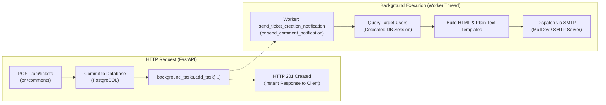
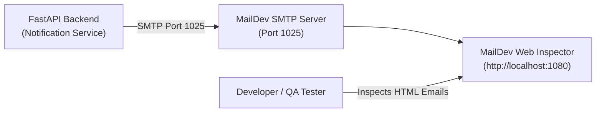

# Automailing & Notification System

The **AI-Supported Ticket System** features a robust, fully automated, and **asynchronous email notification service** (`backend/app/services/notification.py`). It is architected to keep user interactions snappy by decoupling email generation and SMTP transmission from HTTP request handling.

---

## ⚡ Core Architecture: Non-Blocking Background Tasks

When tickets or comments are created, network latency or SMTP server delays must never slow down the user interface.



1. **Instant Client Response**: The client immediately receives `HTTP 201 Created` with the new ticket or comment payload.
2. **Independent Background Worker**: FastAPI's `BackgroundTasks` engine executes the notification routine in a separate worker thread.
3. **Dedicated Session Management**: The background worker creates its own isolated database session (`SessionLocal()`), preventing database locks or race conditions with the completed HTTP request.

---

## 📬 Notification Events & Routing Logic

The notification service implements two automated communication pathways:

### Event 1: New Ticket Creation Notification
- **Trigger**: Any user or customer submits a new ticket.
- **Routing Query**:
  The system queries the database for all active operators where `role='Responsible'` and `assigned_category=ticket.category`:
  ```python
  stmt = select(User).where(
      or_(
          User.role == UserRole.RESPONSIBLE,
          func.lower(cast(User.role, String)) == "responsible",
      ),
      or_(
          User.assigned_category == category_str,
          func.lower(User.assigned_category) == category_str.lower(),
      ),
      User.is_active.is_(True),
  )
  ```
- **Email Contents**:
  - **Ticket ID**: Highlighted in title and metadata table.
  - **Consumer Name**: Full requester name.
  - **Priority Badge**: Color-coded indicator (Red for `High`, Amber for `Medium`, Green for `Low`).
  - **Category**: Department name (e.g., `Finance`, `IT Support`).
  - **AI Summary Card**: Executive synopsis synthesized by Google Gemini.
  - **Call to Action**: Direct button linking to the **Responsible Portal**:
    `http://localhost:3000/?view=responsible`

### Event 2: Ticket Comment & Status Update Notification
- **Trigger**: An operator or customer posts a comment or status change on an existing ticket.
- **Target Recipient**: The `consumer_email` recorded on the ticket (or ticket creator's email).
- **Email Contents**:
  - **Ticket ID & Title**: Context for the conversation update.
  - **Current Status Badge**: Real-time ticket status (`Open`, `In Progress`, `Resolved`, `Closed`).
  - **Author Role**: Identifies whether the update was sent by an operator, owner, or AI assistant.
  - **Comment Text**: Formatted message content with preserved line breaks.
  - **Call to Action**: Direct button deep-linking to the specific ticket view:
    `http://localhost:3000/?ticket={ticket_id}`

---

## 🎨 HTML & Plain-Text Email Templates

Every notification dispatches a `multipart/alternative` MIME email with:
1. **Responsive Dark-Theme HTML**:
   - Styled with modern colors (`#0f172a` slate background, `#1e293b` container cards, and `#38bdf8` accent borders).
   - High visual hierarchy with prominent badges and cards.
   - Compatible with modern webmail, Outlook, Gmail, Apple Mail, and mobile clients.
2. **Clean Plain-Text Fallback**:
   - Formatted ASCII tables and structured sections for terminal clients or accessibility tools.

---

## 🧪 Local MailDev SMTP Testing & Inspection

In development and Docker environments, outgoing messages are routed to **MailDev**, an embedded test SMTP server with a real-time web interface.



- **SMTP Host**: `maildev` (in Docker) or `localhost` (in standalone dev)
- **SMTP Port**: `1025`
- **MailDev Web GUI**: [http://localhost:1080](http://localhost:1080)

Developers and QA testers can inspect outgoing emails in real-time, view rendered HTML, review raw MIME headers, verify recipient addresses, and test mobile layouts without risking sending test emails to real users.

---

## 🛡️ Failure Handling & Resilience

The notification service is engineered to fail gracefully:
- **SMTP Network Resilience**: If the SMTP server is unreachable or times out, the error is caught, logged with an error traceback, and handled cleanly. The API client's request is **never failed** due to downstream email transport issues.
- **Missing Consumer Email**: If a ticket was submitted without a contact email, the comment notification step is skipped automatically with an informational log entry.
- **HTML Sanitization**: All variable fields (`consumer_name`, `ticket_title`, `comment_content`, `ai_summary`) are escaped via `html.escape()` to prevent HTML injection vulnerabilities in email readers.

---

## ⚙️ Environment Configuration

| Variable | Default Value | Description |
| :--- | :--- | :--- |
| `SMTP_HOST` | `maildev` (Docker) / `localhost` | Hostname or IP of the SMTP server. |
| `SMTP_PORT` | `1025` | Port number of the SMTP server. |
| `SMTP_FROM_EMAIL` | `noreply@ticketworkspace.com` | From header address for system notifications. |
| `FRONTEND_URL` | `http://localhost:3000` | Base URL used to construct actionable deep-links in emails. |
