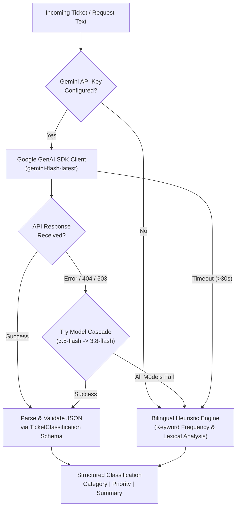

# Backend Architecture & Implementation

The backend of the **AI-Supported Ticket System** is designed as a high-performance, asynchronous REST API developed with **Python 3.11** and **FastAPI**. It adheres to clean architecture principles with strict separation between API routing, data schemas, domain models, and core business services.

---

## 🛠️ Technology Stack & Dependencies

| Component | Library / Tool | Purpose |
| :--- | :--- | :--- |
| **Framework** | `FastAPI` (v0.115+) | High-performance async REST framework with automatic OpenAPI documentation. |
| **ASGI Server** | `Uvicorn` (standard) | Lightning-fast ASGI web server with auto-reloading in development. |
| **ORM** | `SQLAlchemy` (v2.0+) | Declarative 2.0 mapped models, relationship management, and typed queries. |
| **Validation** | `Pydantic` (v2.0+) | Data serialization, strict schema validation, and structured JSON generation. |
| **AI SDK** | `google-genai` | Official Google GenAI SDK for Gemini models with structured JSON output. |
| **HTTP Client** | `HTTPX` | Asynchronous HTTP client for Gemini API communication and external validation. |
| **Email Protocol** | Python `smtplib` + `email.mime` | Native asynchronous MIME multipart email generation and SMTP transmission. |
| **Testing** | `pytest` + `pytest-asyncio` | Automated unit, integration, and security test suite. |

---

## 📂 Backend Directory Structure

```
backend/
├── app/
│   ├── api/                     # REST API Routers
│   │   ├── setup.py             # Setup status, initialization & factory reset
│   │   ├── tickets.py           # Ticket CRUD, AI triage, and comment stream
│   │   └── users.py             # User CRUD & authentication endpoints
│   ├── core/                    # Core configuration & persistence singletons
│   │   ├── database.py          # SQLAlchemy engine, SessionLocal & get_db dependency
│   │   └── setup.py             # SetupManager, PBKDF2 crypto, and config state
│   ├── middleware/              # HTTP Middlewares
│   │   └── setup_middleware.py  # HTTP 428 Precondition Required gatekeeper
│   ├── models/                  # SQLAlchemy 2.0 ORM Declarative Models
│   │   ├── base.py              # Base declarative class & TimestampMixin
│   │   ├── comment.py           # Comment model with role & visibility tracking
│   │   ├── enums.py             # Domain Enums (Category, Priority, Status, Roles)
│   │   ├── ticket.py            # Ticket model with composite indexing
│   │   └── user.py              # User model with hashed credentials
│   ├── schemas/                 # Pydantic v2 Request/Response Contracts
│   │   ├── ai.py                # TicketClassification & TicketTriageRequest
│   │   ├── comment.py           # CommentCreate & CommentRead
│   │   ├── setup.py             # Setup initialization & reset contracts
│   │   ├── ticket.py            # TicketCreate, TicketRead, TicketDetailRead
│   │   └── user.py              # UserCreate, UserLoginRequest, UserRead
│   ├── services/                # Business Domain Services
│   │   ├── notification.py      # Background SMTP dispatch & HTML templating
│   │   └── triage.py            # Gemini AI classification with fallback cascade
│   └── main.py                  # Application entrypoint, lifespan & CORS setup
├── tests/                       # Automated Pytest Suite (34 tests)
│   ├── conftest.py              # Fixtures: in-memory DB, test client, mocks
│   ├── test_ai_triage.py        # Gemini SDK calls, cascade failover, heuristic engine
│   ├── test_models_and_schemas.py # ORM constraints, schema serialization, relationships
│   ├── test_notifications.py    # Background worker, SMTP dispatch, HTML content
│   └── test_setup.py            # Setup state, 428 interception, PBKDF2 hashing
├── Dockerfile                   # Multi-stage container definition
├── pytest.ini                   # Pytest configuration
└── requirements.txt             # Locked dependencies
```

---

## 🔒 Security & First-Time Setup Lifecycle

### 1. The Precondition Gatekeeper (`SetupMiddleware`)
To guarantee that unconfigured containers are never exposed in production:
- On startup, the `lifespan` hook checks for the existence of `setup_state.json` (`/app/config/setup_state.json`).
- If uninitialized, `SetupMiddleware` intercepts all incoming protected requests and returns:
  ```http
  HTTP 428 Precondition Required
  {"detail": "System requires first-time setup before processing requests."}
  ```
- **Unintercepted Whitelist**:
  - `GET /api/setup/status`
  - `POST /api/setup/initialize`
  - `GET /health`
  - `GET /docs`, `GET /redoc`, `GET /openapi.json`
  - `OPTIONS` preflight requests (to preserve full CORS compatibility)

### 2. PBKDF2-HMAC-SHA256 Password Security
System Owner and User credentials are protected using OWASP-recommended baseline cryptography:
- **Algorithm**: `PBKDF2-HMAC-SHA256`
- **Iterations**: `600,000`
- **Salt**: 16-byte cryptographically secure pseudo-random hex token (`secrets.token_hex(16)`)
- **Verification**: Constant-time comparison via `hmac.compare_digest` to prevent timing attacks.

---

## 🤖 Google Gemini AI Triage Engine

The triage service (`backend/app/services/triage.py`) analyzes ticket text and attachment metadata to classify and summarize issues before routing.



### 1. Structured JSON Output
The Gemini client is configured with a strict Pydantic response schema:
```python
class TicketClassification(BaseModel):
    category: TicketCategory  # Finance, Legal, Operations, IT Support, Human Resources, Customer Success
    priority: TicketPriority  # High, Medium, Low
    summary: str             # Concise 1-2 sentence executive issue summary
```

### 2. Model Failover Cascade
To eliminate downtime caused by model deprecations or temporary quota limits, candidate models are tried sequentially:
1. Configured model (from `GEMINI_MODEL` env, defaults to `gemini-flash-latest`)
2. `gemini-flash-latest`
3. `gemini-3.5-flash`
4. `gemini-3.8-flash`

### 3. Bilingual Heuristic Fallback
If the network is unavailable or the API key is missing:
- Analyzes domain-specific vocabularies in both **English and Spanish**.
- Detects emergency and high-impact tokens (`urgent`, `production down`, `bloqueado`, `cobro duplicado`).
- Synthesizes an executive summary from the first salient sentence of the input.

---

## 📡 REST API Reference

### System & Setup Endpoints
| Method | Endpoint | Summary | Description |
| :--- | :--- | :--- | :--- |
| `GET` | `/health` | Health Check | Checks database, maildev, and Gemini status. |
| `GET` | `/api/setup/status` | Setup Status | Returns active status and owner configuration. |
| `POST` | `/api/setup/initialize` | Initialize System | Sets Owner credentials, API key, and DB connection. |
| `POST` | `/api/setup/factory-reset` | Factory Reset | Clears configuration protected by master password. |

### Users & Authentication
| Method | Endpoint | Summary | Description |
| :--- | :--- | :--- | :--- |
| `POST` | `/api/users/login` | User Login | Authenticates Owner or Responsible operator. |
| `GET` | `/api/users` | List Users | Returns all operators (Owner or Responsible). |
| `POST` | `/api/users` | Create User | Creates a new Responsible lead with category assignment. |
| `GET` | `/api/users/{id}` | Get User | Retrieves operator profile by ID. |
| `PATCH` | `/api/users/{id}` | Update User | Updates user role, category assignment, or password. |
| `DELETE` | `/api/users/{id}` | Delete User | Deactivates or removes operator from system. |

### Tickets & Comments
| Method | Endpoint | Summary | Description |
| :--- | :--- | :--- | :--- |
| `POST` | `/api/tickets/triage` | AI Triage Preview | Previews category, priority, and summary for text. |
| `GET` | `/api/tickets` | List Tickets | Filter by `category`, `status`, and `priority`. |
| `POST` | `/api/tickets` | Create Ticket | Creates ticket & enqueues asynchronous notification. |
| `GET` | `/api/tickets/{id}` | Ticket Detail | Returns ticket with loaded comments and assignees. |
| `PATCH` | `/api/tickets/{id}` | Update Ticket | Updates status, priority, or assigned operator. |
| `DELETE` | `/api/tickets/{id}` | Delete Ticket | Deletes ticket and associated comment history. |
| `GET` | `/api/tickets/{id}/comments` | List Comments | Retrieves comment conversation history. |
| `POST` | `/api/tickets/{id}/comments` | Add Comment | Posts comment & dispatches notification to consumer. |

---

## 🧪 Testing & Code Quality

The backend includes a comprehensive automated test suite powered by `pytest`. Run tests locally with:
```bash
pytest backend/tests -v
```
*(With virtualenv on Windows: `.\backend\.venv\Scripts\python.exe -m pytest backend/tests -v`)*
