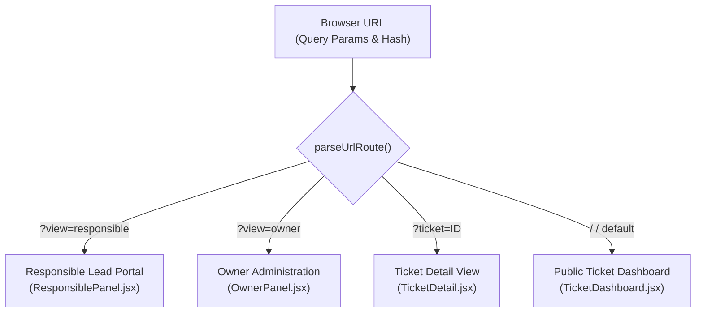

# Frontend Architecture & Frameworks

The frontend of the **AI-Supported Ticket System** is an interactive, responsive Single-Page Application (SPA) designed to serve three distinct personas: **Consumers / Requesters** (who require no authentication), **Responsible Department Leads**, and the **System Owner**.

---

## 🎨 Frameworks & Technologies Used

| Technology / Library | Version | Role / Purpose |
| :--- | :--- | :--- |
| **React** | `^19.0.0` | Core UI library utilizing modern React 19 functional components, hooks (`useState`, `useEffect`, `useCallback`), and concurrent rendering. |
| **Vite** | `^6.1.0` | Next-generation frontend build tool providing near-instantaneous Hot Module Replacement (HMR) and optimized ES module bundling. |
| **Tailwind CSS** | `^3.4.17` | Utility-first CSS framework enabling a cohesive dark-mode design system (`#0b0f19` palette) and responsive layouts. |
| **Lucide React** | `^0.475.0` | High-performance, lightweight SVG icon library used across navigation, badges, action buttons, and status indicators. |
| **PostCSS & Autoprefixer** | `^8.4.49` / `^10.4.20` | CSS transformations and automated vendor prefixing for cross-browser reliability. |
| **clsx & tailwind-merge** | `^2.1.1` / `^2.6.0` | Conditional class composition and safe utility conflicts resolution for UI elements. |

---

## 📂 Frontend Directory Structure

```
frontend/
├── src/
│   ├── components/              # Modular UI Components
│   │   ├── CommentStream.jsx    # Chronological conversation stream & internal notes
│   │   ├── ConsumerModal.jsx    # Public ticket creation modal with instant AI preview
│   │   ├── Header.jsx           # Top navigation bar, status pill, role indicators
│   │   ├── LeadSwitcher.jsx     # Dropdown to filter department tickets for leads
│   │   ├── OwnerPanel.jsx       # Owner administration: operator management & factory reset
│   │   ├── ResponsiblePanel.jsx # Department lead workspace: ticket queue & status workflow
│   │   ├── SetupModal.jsx       # Mandatory first-time setup wizard (HTTP 428 trigger)
│   │   ├── TicketDashboard.jsx  # Interactive filterable ticket table with category pills
│   │   ├── TicketDetail.jsx     # Deep ticket view with status switcher & assignees
│   │   └── Toast.jsx            # Dynamic feedback notifications (success/error/info)
│   ├── services/
│   │   └── api.js               # Centralized Fetch API client with HTTP 428 interceptor
│   ├── App.css                  # Custom styling overrides
│   ├── App.jsx                  # Root application component, routing & session state
│   ├── index.css                # Tailwind directives & global typography
│   └── main.jsx                 # React root DOM mounting point
├── public/                      # Static assets
├── Dockerfile                   # Vite container build & development server
├── index.html                   # HTML5 application shell
├── package.json                 # Project dependencies & npm scripts
├── postcss.config.js            # PostCSS configuration
├── tailwind.config.js           # Tailwind theme configuration
└── vite.config.js               # Vite bundler configuration
```

---

## 🧭 Client-Side Routing & State Management

The frontend utilizes an intuitive, history-synchronized routing mechanism that operates cleanly without bloated router packages:



### URL Synchronization
- **Responsible Portal**: `http://localhost:3000/?view=responsible` (or `#responsible`)
- **Owner Admin Portal**: `http://localhost:3000/?view=owner` (or `#owner`)
- **Ticket Deep-Link**: `http://localhost:3000/?ticket=14` (or `#ticket-14`)
- Links sent via **email notifications** directly navigate operators or consumers to the precise ticket or portal view using these URL patterns.

### Session Persistence
User authentication sessions for **System Owner** and **Responsible Leads** are preserved across page reloads using browser `localStorage`:
- `owner_session`: Stores owner profile and token context.
- `responsible_session`: Stores lead operator details, email, and `assigned_category`.
- A dedicated logout action clears the storage key and prompts toast confirmation.

---

## 🧩 Key Component Breakdown

### 1. `App.jsx` (Root Orchestrator)
- Manages application-level states: active view, selected ticket ID, ticket collection, backend health, and toast messages.
- Continuously probes `/health` on startup to detect if first-time initialization is required.
- Subscribes to browser `popstate` and `hashchange` events for seamless browser forward/backward navigation.

### 2. `ConsumerModal.jsx` (Public Requester Modal)
- Allows any user or customer to submit a support request without signing up.
- **Fields**: Requester Full Name, Email Address, Ticket Title, Problem Description, Optional Attachment URL.
- **Real-Time AI Preview**: As users type their issue, an optional "Analyze with AI" trigger contacts `/api/tickets/triage` to preview the suggested department category and priority level.

### 3. `TicketDashboard.jsx` (Interactive Queue)
- Displays all tickets with visual status badges (`Open`, `In Progress`, `Resolved`, `Closed`).
- Offers instant multi-filter controls:
  - **Category Pills**: `All`, `Finance`, `Legal`, `Operations`, `IT Support`, `Human Resources`, `Customer Success`.
  - **Status Filter**: Fast toggling between active and resolved states.
  - **Live Search**: Client-side query filter across ticket title, description, and consumer name.

### 4. `TicketDetail.jsx` (Comprehensive Workspace)
- Displays full ticket metadata, consumer contact details, AI triage classification, and confidence score.
- **Interactive Controls**:
  - Direct status modification (`Open` → `In Progress` → `Resolved` → `Closed`).
  - Assignee selector (assign ticket to any registered operator).
  - Chronological comment timeline (`CommentStream.jsx`) with support for internal staff-only notes.

### 5. `ResponsiblePanel.jsx` (Lead Portal)
- Authentication card for department operators (`email` + `password`).
- Upon login, automatically scopes the ticket queue to the operator's `assigned_category`.
- Enables rapid ticket assignment to self and direct reply posting.

### 6. `OwnerPanel.jsx` (Executive Administration)
- Authentication card for the System Master Owner.
- **User Management Tab**:
  - View all registered system operators.
  - Create new Responsible leads with specific department assignments.
  - Update user roles, change department assignments, and toggle active/inactive status.
- **System Settings Tab**:
  - Displays PostgreSQL, MailDev, and Gemini API integration health.
  - **Master Password Protected Factory Reset**: Allows wiping setup state and database tables.

### 7. `SetupModal.jsx` (First-Time Setup Wizard)
- Rendered as an unavoidable modal overlay whenever the backend responds with `HTTP 428 Precondition Required`.
- Guides the initial administrator through setting:
  - Owner Email & Master Password
  - Google Gemini API Key
  - PostgreSQL Host, Port, Database Name, User, and Password
- Features real-time validation before submitting configuration to `POST /api/setup/initialize`.

---

## 🌐 API Service Layer (`src/services/api.js`)

All network communication with the backend is abstracted via a unified client:
```javascript
// Centralized error handling & HTTP 428 interception
if (response.status === 428) {
  const data = await response.json().catch(() => ({}));
  throw new ApiError('Setup Required: Application is not yet initialized.', 428, data);
}
```
The service exports typed request wrappers for:
- `api.checkHealth()` & `api.getSetupStatus()`
- `api.initializeSystem(payload)` & `api.factoryReset(payload)`
- `api.listTickets(filters)` & `api.getTicket(id)`
- `api.createTicket(payload)` & `api.updateTicket(id, payload)`
- `api.triageTicket(payload)`
- `api.listComments(ticketId)` & `api.addComment(ticketId, payload)`
- `api.login(payload)` & `api.listUsers()`
