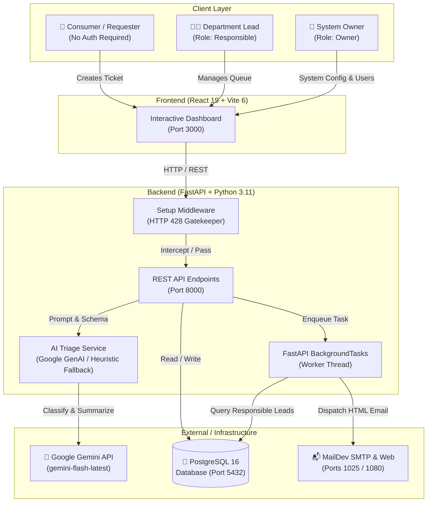

# AI-Supported Ticket System Wiki

Welcome to the official documentation wiki for the **AI-Supported Ticket System**!

This project is a modern, enterprise-grade, dockerized support ticket management platform. It combines an interactive React 19 frontend dashboard, a high-performance FastAPI backend, a PostgreSQL 16 relational database, Google Gemini AI automated triage, and an asynchronous, non-blocking email notification service inspected via MailDev.

---

## 📚 Documentation Index

Explore the comprehensive guides below for deep architectural and operational details:

| Section | Description |
| :--- | :--- |
| 🚀 **[End-to-End User Process](User-Process)** | Complete user journeys from first-time setup wizard to consumer ticket creation, operator triage, and administrative oversight. |
| ⚙️ **[Backend Architecture](Backend)** | FastAPI framework design, Pydantic v2 schemas, PBKDF2 password security, dependency injection, and Gemini AI triage engine with failover. |
| 💻 **[Frontend Architecture & Frameworks](Frontend)** | React 19, Vite 6, Tailwind CSS 3.4, Lucide icons, role-based views (Consumer, Responsible, Owner), and client-side routing. |
| 🗄️ **[Database Architecture & Data Flow](Database)** | PostgreSQL 16 schema, SQLAlchemy 2.0 ORM models, relationships, indexing strategies, and Mermaid ER diagrams. |
| ✉️ **[Automailing & Notification System](Automailing)** | Asynchronous non-blocking email service via FastAPI `BackgroundTasks`, MailDev SMTP integration, responsive HTML templates, and targeted operator routing. |

---

## 🏛️ High-Level System Architecture

---

## 🌟 Key Highlights

1. **Zero-Friction First-Time Setup**: Automatic hardware and configuration detection. When uninitialized, the system gracefully intercepts requests with `HTTP 428 Precondition Required` and displays a modern configuration wizard.
2. **AI-Powered Triage**: Each incoming ticket is analyzed by Google Gemini to determine department category (`Finance`, `Legal`, `Operations`, `IT Support`, `Human Resources`, `Customer Success`), priority (`High`, `Medium`, `Low`), and an executive summary.
3. **Bilingual Heuristic Fallback**: Zero downtime guarantee. If network timeouts or missing API keys occur, an intelligent English/Spanish heuristic classifier takes over seamlessly.
4. **Asynchronous Non-Blocking Notifications**: Powered by FastAPI `BackgroundTasks`. The consumer gets an immediate `HTTP 201 Created` response without waiting for SMTP delays.
5. **Local Email Sandbox**: Integrated MailDev server provides instant inspection of all outgoing HTML emails at [http://localhost:1080](http://localhost:1080).
6. **OWASP-Grade Security**: PBKDF2-HMAC-SHA256 password hashing with 600,000 iterations and constant-time comparison.
