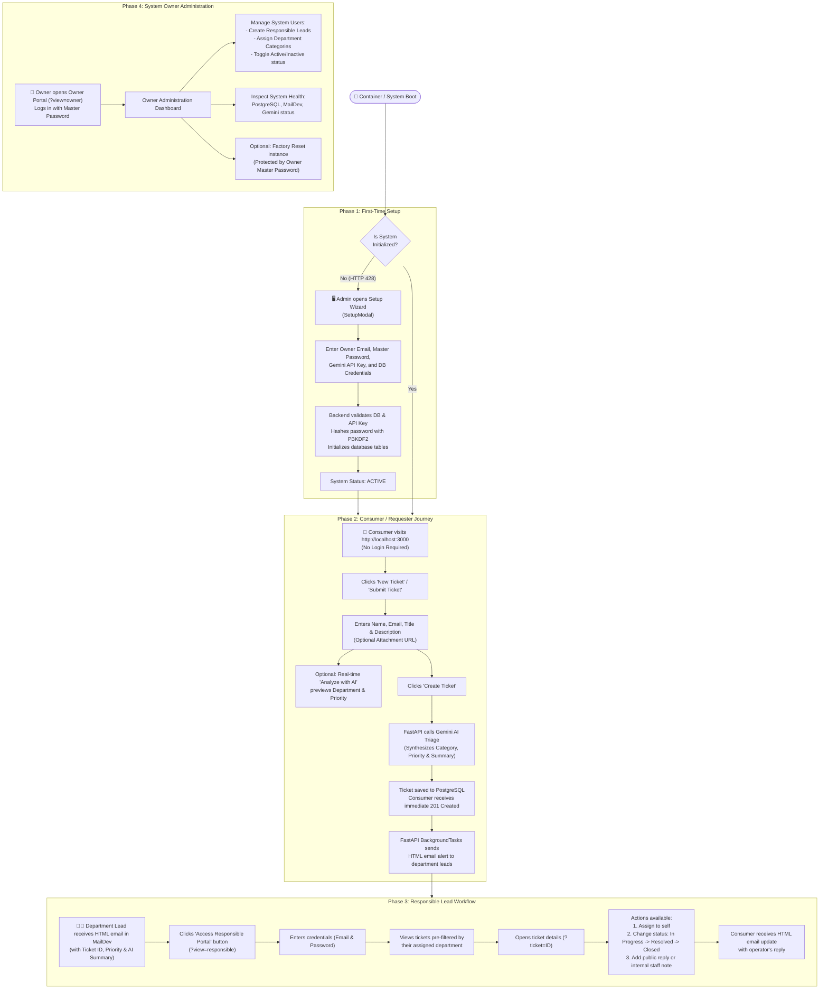

# End-to-End User Process & Lifecycle

This document explains the complete, end-to-end user process of the **AI-Supported Ticket System**, covering every phase of interaction from the initial deployment setup to consumer ticket creation, automated AI classification, operator triage, and administrative management.

---

## 🗺️ High-Level User Journey Map

---

## 📌 Detailed Phase-by-Phase Walkthrough

### ⚙️ Phase 1: First-Time Setup Wizard

When the application is started for the first time, no administrator account or database schema exists:

1. **Gatekeeper Detection**:
   - Any access to protected API endpoints returns `HTTP 428 Precondition Required`.
   - The frontend intercepts this response and presents an unclosable **Setup Wizard** (`SetupModal.jsx`).
2. **Configuration Inputs**:
   - **System Owner Email**: The administrative root email address.
   - **Owner Master Password**: Protected by PBKDF2-HMAC-SHA256 (600,000 iterations).
   - **Google Gemini API Key**: Used for automated ticket classification and summarization.
   - **PostgreSQL Credentials**: Host, port, database name, user, and password.
3. **Atomic Initialization**:
   - The backend validates the Gemini key against Google's API.
   - Tests socket reachability to PostgreSQL.
   - Saves `/app/config/setup_state.json` atomically with restricted file permissions.
   - Initializes all database tables (`init_db()`).
   - The system transitions to **ACTIVE** mode and unblocks all functionality.

---

### 👤 Phase 2: Consumer / Requester Workflow

Consumers and customers can report problems seamlessly without cumbersome account registration:

1. **Open Ticket Modal**:
   - The user visits the homepage ([http://localhost:3000](http://localhost:3000)) and clicks the **"New Ticket"** button in the header or dashboard.
2. **Fill in Request Details**:
   - **Full Name**: e.g., "Sarah Connor"
   - **Email Address**: e.g., "sarah.connor@cyberdyne.com" (used for email updates)
   - **Title**: e.g., "Cannot connect to VPN from remote office"
   - **Description**: Detailed explanation of the symptoms and errors encountered.
   - **Attachment URL**: Optional screenshot or diagnostic log link.
3. **Automated AI Triage**:
   - Upon clicking **"Create Ticket"**, the backend passes the text to the **Gemini AI Triage Engine**.
   - Gemini classifies the ticket into one of the 6 core departments: `IT Support`.
   - Assigns priority based on business urgency: `High`.
   - Generates an executive summary: *"Requester cannot establish VPN connectivity from remote office; network troubleshooting required."*
4. **Immediate Confirmation**:
   - The consumer receives an instant confirmation toast and can view their ticket on the public dashboard.
5. **Asynchronous Notification**:
   - A background thread automatically generates and dispatches an HTML email to all registered department leads for `IT Support`.

---

### 🧑‍💼 Phase 3: Responsible Lead (Operator) Workflow

Department leads manage and resolve tickets assigned to their specific category:

1. **Email Alert**:
   - The operator receives an HTML email in **MailDev** ([http://localhost:1080](http://localhost:1080)) detailing the new ticket, its priority badge, and the AI summary.
   - Clicks the button: **"Access Responsible Portal →"**.
2. **Lead Login**:
   - The operator enters their credentials at `http://localhost:3000/?view=responsible`.
3. **Department Queue**:
   - The dashboard displays only tickets matching the lead's `assigned_category`.
   - The operator can sort by priority, inspect creation dates, or search across ticket text.
4. **Ticket Resolution Flow**:
   - **Step 1 - Assignment**: The lead assigns the ticket to themselves via the assignee dropdown.
   - **Step 2 - Status Progression**:
     - Changes status from `Open` → `In Progress`.
   - **Step 3 - Communication**:
     - Posts a comment explaining the workaround or asking for further details.
     - An automated notification is immediately emailed to `sarah.connor@cyberdyne.com`.
   - **Step 4 - Resolution**:
     - Once solved, changes status to `Resolved` or `Closed`.

---

### 👑 Phase 4: System Owner (Administrator) Workflow

The System Owner possesses comprehensive oversight of all departments, users, and platform settings:

1. **Owner Login**:
   - Navigates to `http://localhost:3000/?view=owner` and logs in with the master owner password configured during setup.
2. **User Management**:
   - **Create New Leads**: Click "Add User" to register operators with their email, temporary password, full name, role (`Responsible`), and assigned department.
   - **Edit Roles & Categories**: Modify an operator's department or role as team structures evolve.
   - **Deactivate Users**: Toggle `is_active` to immediately revoke portal access.
3. **System Settings**:
   - Inspect live status indicators for the PostgreSQL database, MailDev SMTP server, and Gemini AI key.
4. **Factory Reset**:
   - In development or staging, the Owner can trigger a complete **Factory Reset** protected by the master password, with an optional toggle to drop all database tables and restore the initial setup wizard.

---

## 🎯 Summary of User Permissions & Roles

| Action / Capability | Consumer | Responsible Lead | System Owner |
| :--- | :---: | :---: | :---: |
| **View Public Ticket Dashboard** | ✅ | ✅ | ✅ |
| **Submit New Support Ticket** | ✅ (No Auth) | ✅ | ✅ |
| **Receive Email Updates on Comment** | ✅ | — | — |
| **Login to Department Lead Portal** | ❌ | ✅ | ✅ |
| **Filter Tickets by Assigned Category** | ❌ | ✅ (Automatic) | ✅ (All) |
| **Update Ticket Status & Assignee** | ❌ | ✅ | ✅ |
| **Post Public Comments & Internal Notes** | ❌ | ✅ | ✅ |
| **Create & Manage Operator Accounts** | ❌ | ❌ | ✅ |
| **View System Infrastructure Status** | ❌ | ❌ | ✅ |
| **Execute System Factory Reset** | ❌ | ❌ | ✅ |
